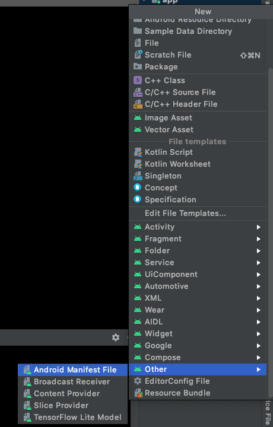
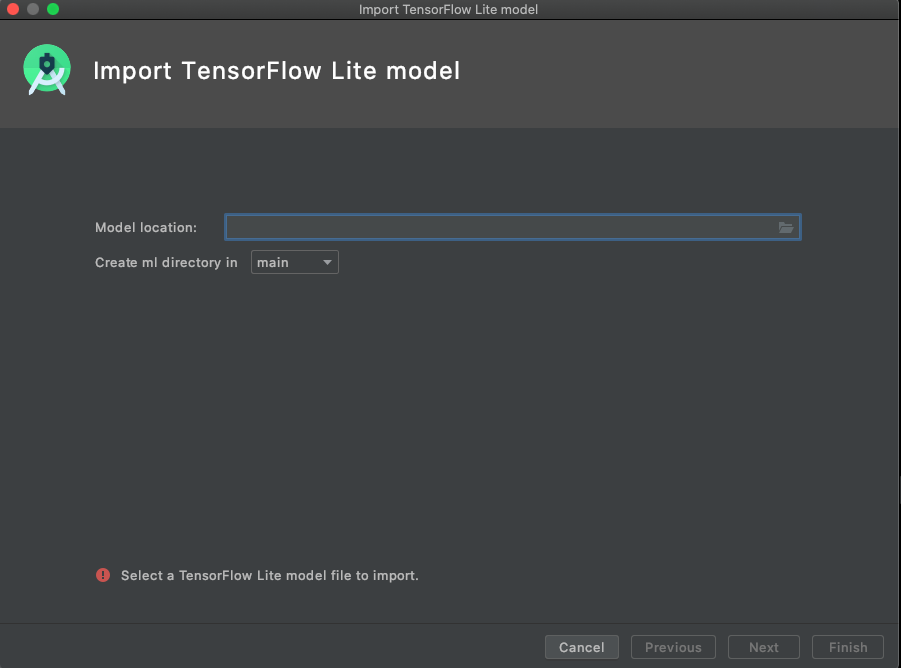
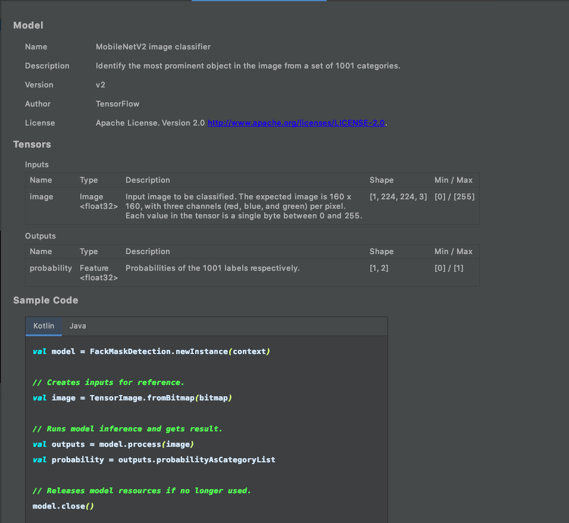

Android face-mask detection
===

A small machine-learning app to predict wearing face-mask or not.

Use [CameraX](https://developer.android.com/training/camerax) to get camera preview(live-screen) without distinguishing camera and camera2.

Use on-device machine-learning framework [Tensorflow-Lite](https://www.tensorflow.org/lite) for local model prediction, no cloud network requred, totally offline.

Use Android's gradle tool `>= 4.1.0` to generate client [Tensorflow-Lite](https://www.tensorflow.org/lite) model proxy easily. With the new Tool, the proxy of the model can be generated without having to feel discouraged about complicated byte operations.

📝: The CameraX and TF-lite APIs are still not in RELEASE, all APIs and usage of them could be changed in the future.

# Tech stack

- [CameraX](https://developer.android.com/training/camerax)
    - [CameraX](https://developer.android.com/training/camerax) is the modern camera API of Android development, back-port to Android 5. Saving code to determine camera and camera2 because of Android's version fragments.
    - Constraint the camera inside a lifecycle(`androidx.camera.lifecycle`), don't need to care of disposing and resource wasting, there will be no more memory leaks.
    - Setup camera with new configurable binding logic on the lifecycle.
    
- [Tensorflow-Lite](https://www.tensorflow.org/lite) 
    - [Tensorflow-Lite](https://www.tensorflow.org/lite), on-device local ML framework.
    
- Android's gradle tool `>= 4.1.0`: Android Studio 4.1 is at-least required.

- [ActivityResultContract](https://developer.android.com/reference/androidx/activity/result/contract/ActivityResultContract) (still WIP for camera permission handling)
 
# How does CameraX work

1. An `ExecutorService` for processing bitmap or image analysis.
2. Require camera permission if the permission is not granted.
3. A `ProcessCameraProvider` which provides camera specifications, eg: availability of front/rear face.
4. Bind different functionalities on the or depending on `ProcessCameraProvider`.
5. An object ` ImageAnalysis.Analyzer ` for `ImageAnalysis`.

## dito

- `setupCameraThread`: Create `ExecutorService`.
- `setupCameraControllers`: Some controllers, like switch of camera lens-facing.
- `setupCamera`: Create `ProcessCameraProvider` and future handling of binding different functionalities.
- `setupCameraUseCases`: Binding functionalities.  
    - `CameraSelector`: Switch camera lens-facing.
    - `Preview`: Preview screen (live-screen).
    - `ImageAnalysis`: Working with an `ExecutorService` and analyze every frame (bitmap).
        - An object of ` ImageAnalysis.Analyzer ` is required.

# How does Tensorflow-Lite and Grade-Tool work

1. Have a machine-learning model for face-mask prediction which has been trained and converted to lite-mode, you can find it [here](app/src/main/ml/face_mask_detection.tflite).

2. Use Android Studio to import the model.
    - Start the tool: the menu selection on **New/Other/Tensorflow Lite Model**

    

    - Import model

    

    - Generate client model proxy
    
    

## dito

- `setupML`: Initialize  model proxy, set extra options eg: GPU or number of running thread.

```kotlin
        val options: Model.Options =
            Model.Options.Builder().setDevice(Model.Device.GPU).setNumThreads(5).build()
        faceMaskDetection = FackMaskDetection.newInstance(applicationContext, options)
```

- `setupMLOutput`: Read a `Bitmap` and predict wearing face-mask or not.

```kotlin
     val tensorImage: TensorImage = TensorImage.fromBitmap(bitmap)
        val result: FackMaskDetection.Outputs = faceMaskDetection.process(tensorImage)
        val output: List<Category> =
            result.probabilityAsCategoryList.apply {
                sortByDescending { res -> res.score }
            }
        lifecycleScope.launch(Dispatchers.Main) {
            output.firstOrNull()?.let { category ->
                // TODO: UPDATE UI....
                // category.label, category.score
            }
        }
```


# License

```
Copyright 2020 Chris Xinyue Zhao

Permission is hereby granted, free of charge, to any person obtaining a copy of this software and associated documentation files (the "Software"), to deal in the Software without restriction, including without limitation the rights to use, copy, modify, merge, publish, distribute, sublicense, and/or sell copies of the Software, and to permit persons to whom the Software is furnished to do so, subject to the following conditions:

The above copyright notice and this permission notice shall be included in all copies or substantial portions of the Software.

THE SOFTWARE IS PROVIDED "AS IS", WITHOUT WARRANTY OF ANY KIND, EXPRESS OR IMPLIED, INCLUDING BUT NOT LIMITED TO THE WARRANTIES OF MERCHANTABILITY, FITNESS FOR A PARTICULAR PURPOSE AND NONINFRINGEMENT. IN NO EVENT SHALL THE AUTHORS OR COPYRIGHT HOLDERS BE LIABLE FOR ANY CLAIM, DAMAGES OR OTHER LIABILITY, WHETHER IN AN ACTION OF CONTRACT, TORT OR OTHERWISE, ARISING FROM, OUT OF OR IN CONNECTION WITH THE SOFTWARE OR THE USE OR OTHER DEALINGS IN THE SOFTWARE.
```
